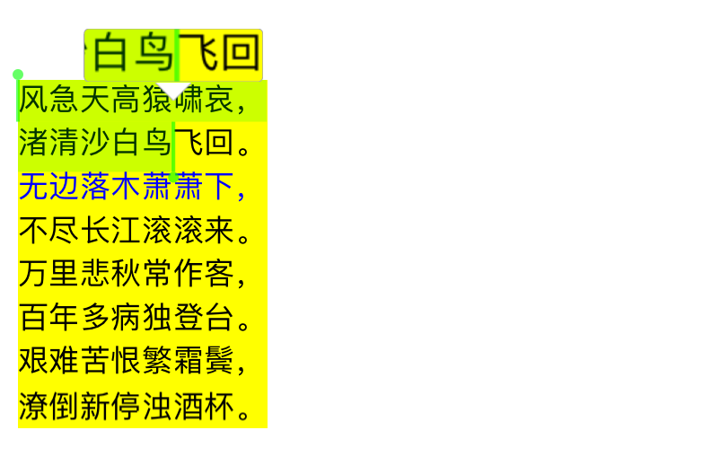
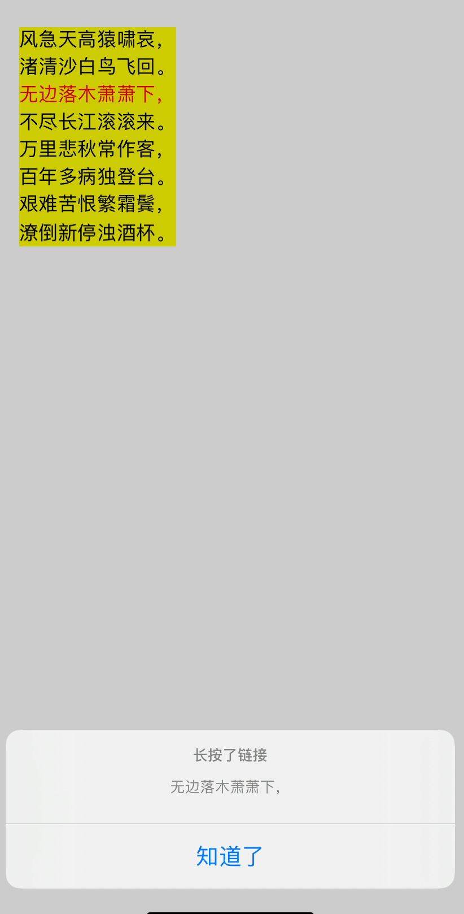
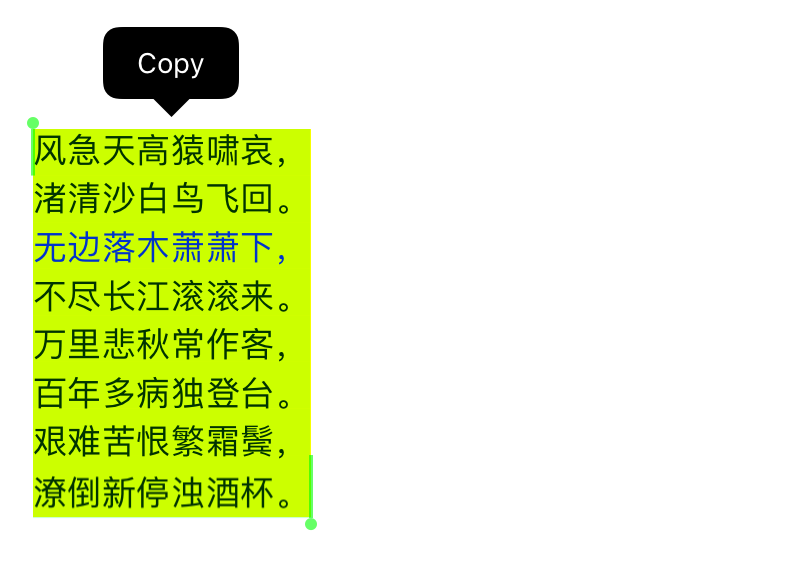

XXAttributedLabel
==================


基于<a href="https://github.com/solehe/TMAttributedLabel">TMAttributedLabel</a>实现，让Label也可支持select、copy等操作。





# 特性
* 支持<a href="https://github.com/solehe/TMAttributedLabel">TMAttributedLabel</a>的所有特性
* 支持select相关属性
   * `触发时长`
   * `状态` 
   * `放大镜状态`
   * `选中背景色`
   * `锚点颜色`
   * `选中文本`
    

# 系统要求
* iOS 9.0 及以上
* 需要 ARC

# 集成

### Podfile

```ruby
pod 'XXAttributedLabel'
```

### 手动集成

* `git clone https://github.com/solehe/XXAttributedLabel`
* 拷贝 `XXAttributedLabel` 中的源代码到你的工程中


# 使用方法

## 基本使用

```objc

XXAttributedLabel *label = [[XXAttributedLabel alloc] initWithFrame:CGRectMake(20, 100, 335, 180)];
[label setBackgroundColor:[UIColor yellowColor]];
[label setLinkHighlightColor:[UIColor redColor]];
[label setLineSpacing:3.f];
[label setNumberOfLines:0];
[label setTag:1024];
[self.view addSubview:label];

[label append:@"风急天高猿啸哀，\n"];
[label append:@"渚清沙白鸟飞回。\n"];
[label append:@"无边落木萧萧下，\n"];
[label append:@"不尽长江滚滚来。\n"];
[label append:@"万里悲秋常作客，\n"];
[label append:@"百年多病独登台。\n"];
[label append:@"艰难苦恨繁霜鬓，\n"];

// 支持选择
[label setEnableSelected:YES];
   
```

## 长按链接

```objc

// 添加链接
NSString *linkString = @"无边落木萧萧下，";
NSRange range = [label.text rangeOfString:linkString];
[label addCustomLink:linkString forRange:range color:[UIColor blueColor]];

// 长按链接回调
[label setLongPressedLinkBlock:^(id  _Nonnull linkData, LongPressedEndBlock  _Nonnull block) {
    
    NSString *linkString = nil;
    
    if ([linkData isKindOfClass:[NSString class]]) {
        linkString = linkData;
    } else {
        linkString = [label.text substringWithRange:[linkData rangeValue]];
    }

    // TODO 在这里处理链接长按事件
    // ...
}];

```




## 点击链接

```objc

// 设置代理
[label setDelegate:self];

// 实现代理方法
- (void)attributedLabel:(TMAttributedLabel *)label clickedOnLink:(id)linkData {
    
    if ([linkData isKindOfClass:[NSString class]]) {
        NSLog(@"点击了链接：%@", linkData);
    }
    else {
        NSLog(@"点击了链接：%@", [label.text substringWithRange:[linkData rangeValue]]);
    }
}

```


## copy

```objc

// 选择触发监听
__weak typeof(label) weak_label = label;
[label setSelectingListenBlock:^(BOOL selecting) {
    if (selecting) {
        [self.view becomeFirstResponder];
        [[UIMenuController sharedMenuController] showMenuFromView:weak_label rect:weak_label.bounds];
    } else {
        [self.view resignFirstResponder];
        [[UIMenuController sharedMenuController] hideMenu];
    }
}];

// 放大镜触发监听
[label setMagnifyDisplayBlock:^(BOOL display) {
    if (display) {
        [[UIMenuController sharedMenuController] hideMenu];
        
    } else {
        [[UIMenuController sharedMenuController] showMenuFromView:weak_label rect:weak_label.bounds];
    }
}];


#pragma mark - 重写父视图以下方法

- (BOOL)canBecomeFirstResponder {
    return YES;
}

- (BOOL)canPerformAction:(SEL)action withSender:(id)sender
{
    if (action == @selector(copy:)) {
        return YES;
    } else {
        return NO;
    }
}

- (void)copy:(id)obj {
    XXAttributedLabel *label = [self.view viewWithTag:1024];
    [[UIPasteboard generalPasteboard] setString:label.selectedText];
}
    
    
```




# 联系我
* https://github.com/solehe
* soleworld@163.com


# 许可证

XXAttributedLabel 使用 [MIT license][MIT] 许可证，详情见 LICENSE 文件。
